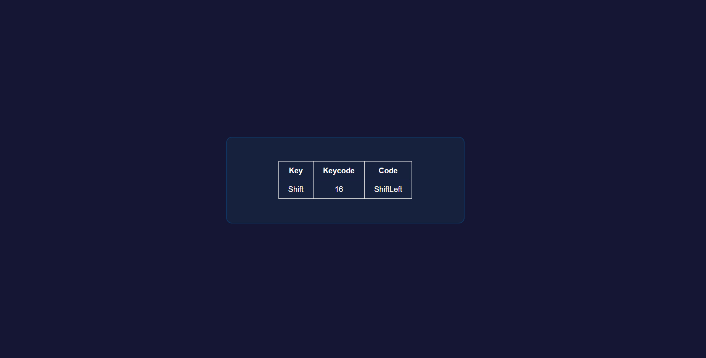

# ⌨️ Keyboard Event Tracker

A simple JavaScript project that displays information about the key pressed by the user in real time. This project was built to practice keyboard events, DOM manipulation, and event handling.

## 🚀 Features

- Detects every key press
- Displays the pressed key
- Shows the key code
- Displays the event code
- Updates information instantly
- Beginner-friendly interface

## 🛠️ Built With

- HTML5
- CSS3
- JavaScript (ES6)

## 📚 Concepts Practised

- Keyboard Events
- `keydown` Event
- Event Object
- DOM Manipulation
- Event Listeners
- Dynamic HTML Updates

## 📂 Project Structure

```
Keyboard-Project/
│── index.html
│── style.css
│── script.js
│── README.md
│── images/
    └── screenshot.png
```

## ▶️ How to Run

1. Clone the repository.

```bash
git clone https://github.com/bhumikaa0006-create/keyboard.git
```

2. Open the project folder.

3. Open `index.html` in your browser.

## 📸 Screenshot



## 🌐 Live Demo

 https://bhumikaa0006-create.github.io/keyboard/

## 🎯 Learning Outcome

This project helped me understand:

- Keyboard events in JavaScript
- The `keydown` event
- Properties like `event.key`, `event.code`, and `event.keyCode`
- How JavaScript updates the DOM dynamically
- Working with event listeners

## 👩‍💻 Author

**Bhumika Narula**

GitHub: https://github.com/bhumikaa0006-create